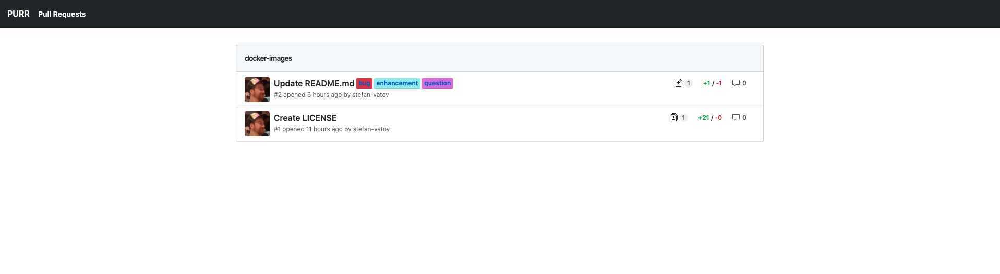

# PURR

Pull Request Review Dashboard



## Disclaimer

This is a weekend project to play around with Elixir.
It uses https://primer.style/css/ | https://github.com/primer/css/ to achieve visual consistency with the GitHub UI. All design props go to them.

## Development

To start your Phoenix server:

- Install dependencies with `mix deps.get`
- Install Node.js dependencies with `cd assets && npm install`
- Start Phoenix endpoint with `mix phx.server`
- `iex -S mix phx.server`

## Config

Add `config/purr.exs`

```Elixir
use Mix.Config

config :purr, :github,
  url: "https://api.github.com/",
  token: "<token>"

config :purr, :repos, [
  %{owner: "<owner>", name: "<repo>"},
  %{owner: "<owner>", name: "<repo>"}
]

config :purr, Purr.Scheduler,
  jobs: [
    {"*/2 * * * *", fn -> Purr.Fetcher.get_all() end}
  ]

```

`config/prod.secret.exs`

```Elixir
use Mix.Config

secret_key_base =
  System.get_env("SECRET_KEY_BASE") ||
    raise """
    environment variable SECRET_KEY_BASE is missing.
    You can generate one by calling: mix phx.gen.secret
    """

config :purr, PurrWeb.Endpoint,
  http: [:inet6, port: String.to_integer(System.get_env("PORT") || "4000")],
  secret_key_base: secret_key_base
```

Following the example above the data is refreshed every 2 minutes from GitHub.

## Running

Project is currenty experimental. Having said that, getting it up and running with Docker:

1. Clone this repository
1. `docker build -t <tag> .`
1. `docker run -p 80:4000 <tag | image id>`

This assumes you've added `config/purr.exs`.
